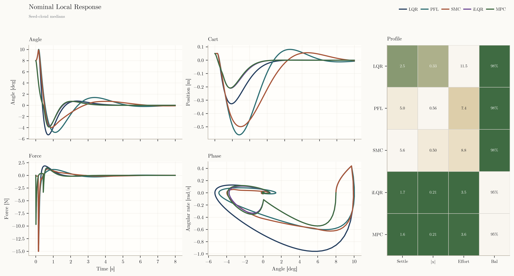
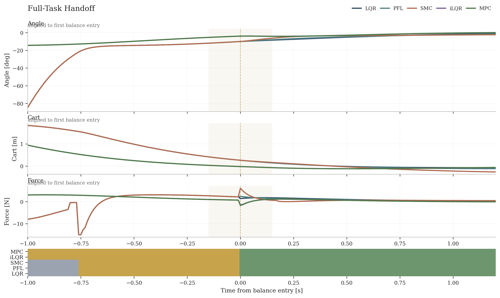
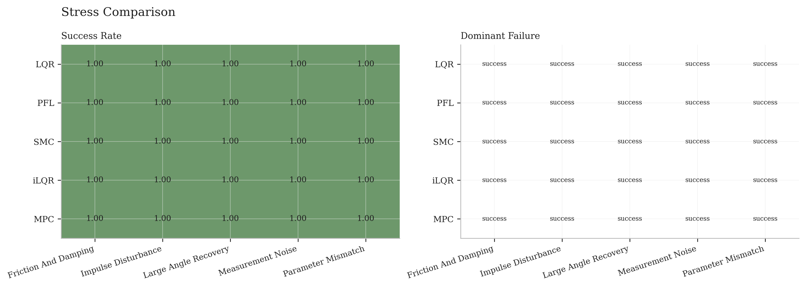
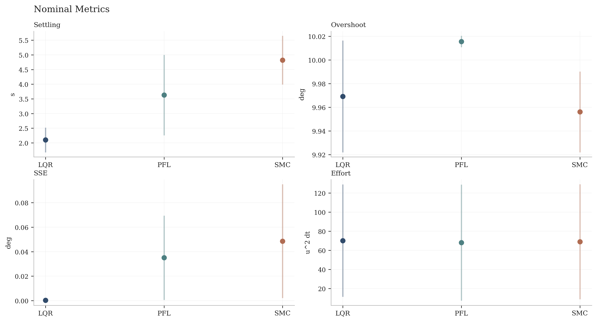
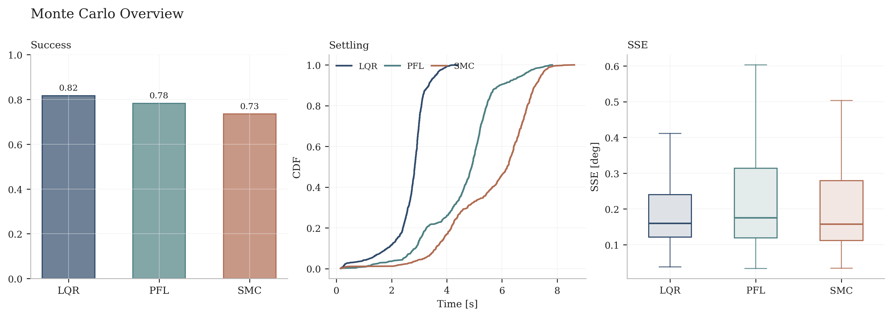
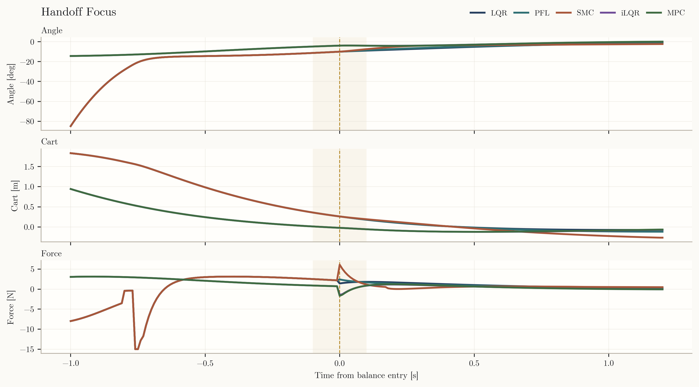

# Nonlinear Cart-Pole

*Full nonlinear cart-pole dynamics, shared swing-up, and three compared upright stabilizers: `LQR`, `PFL`, and `SMC`.*

This repository packages a nonlinear cart-pole benchmark with repeatable experiment suites, artifact export, figure generation, and GIF rendering. The project compares three stabilization strategies under the same swing-up and capture pipeline so that the differences come from the balance controller rather than from different task setups.

## Preview


Nominal full-task comparison with synchronized playback across `LQR`, `PFL`, and `SMC`.


Zoomed comparison around balance entry, centered on the capture-to-stabilization transition.

## Why Nonlinear Cart-Pole

The cart-pole is compact enough to understand end to end, but still exposes real control design tradeoffs:

- nonlinear, underactuated dynamics
- switching between energy injection and near-upright stabilization
- state and input constraints
- robustness questions under disturbance, noise, friction, and parameter mismatch
- clear controller tradeoffs that can be visualized directly

This repository is written as an engineering benchmark and demonstration rather than a formal research study.

## System Model

The state is

```text
s = [x, x_dot, theta, theta_dot]
```

with the convention:

- `theta = 0` is upright
- `theta = pi` is downward
- angles are wrapped to `[-pi, pi]`

The plant model is fully nonlinear and includes:

- cart friction
- pivot damping
- force saturation
- track limits
- optional pulse disturbances
- optional measurement noise

Nominal plant parameters are defined in `configs/system/default.json`.

## Control Stack

### Shared swing-up

All controllers use the same shared pre-balance pipeline:

- `energy_pump` for continuous energy shaping and cart centering
- `capture_assist` for the near-upright approach before handoff

### Stabilizers

The compared balance controllers are:

- `LQR`
- `Feedback Linearization (PFL)`
- `Sliding Mode Control (SMC)`

### Hybrid switching

The runtime controller moves through:

- `energy_pump`
- `capture_assist`
- `balance`

Each run stores explicit handoff and failure diagnostics, including:

- `failure_reason`
- `first_balance_time`
- `balance_fraction`
- `min_abs_theta_deg`
- `max_abs_x`
- `max_abs_theta_dot`

## Benchmark Suite

### Nominal scenarios

- `local_small_angle`
- `full_task_hanging`

### Stress scenarios

- `measurement_noise`
- `impulse_disturbance`
- `friction_and_damping`
- `large_angle_recovery`
- `parameter_mismatch`

### Monte Carlo

The repository also includes a Monte Carlo benchmark that samples:

- initial angle and angular rate
- disturbance settings
- friction and damping
- plant mismatch

## Results at a Glance

- All repeated-seed nominal scenarios succeeded for `LQR`, `PFL`, and `SMC`.
- All repeated-seed stress scenarios succeeded for `LQR`, `PFL`, and `SMC`.
- Monte Carlo success rates on the saved benchmark are:
  - `LQR = 0.817`
  - `PFL = 0.783`
  - `SMC = 0.735`
- `LQR` is the fastest baseline after handoff.
- `PFL` and `SMC` are slower, but remain reliable across the evaluated suites.

## Visual Results

### Local stabilization



Near-upright recovery under the three stabilizers, shown as angle, cart motion, input force, and local phase behavior.

### Full task from hanging



Shared swing-up and capture followed by controller-specific balance behavior. The figure emphasizes the handoff interval and the post-capture settling response.

### Stress suite summary



Stress-case matrix summarizing repeated-seed outcomes across disturbance, damping, mismatch, and recovery scenarios.

### Nominal metric summary



Compact comparison of settling time, overshoot, steady-state error, and control effort for the nominal suite.

### Monte Carlo overview



Monte Carlo summary showing success rate, settling-time distribution, and steady-state error distribution.

### Handoff detail



Focused view of the balance-entry region, useful for understanding how each controller behaves immediately after capture.

### Single-controller motion example


Representative full-task run for `LQR`, rendered with the same white paper-style layout used throughout the project.

### Additional comparison view


Synchronized stress-case comparison for the three stabilizers.

## Repository Layout

```text
configs/                JSON configs for plant, controllers, experiments, and rendering
src/cartpole_bench/     Installable package
tests/                  Unit and smoke tests
docs/media/             Curated showcase assets used by this README
artifacts*/             Generated tables, figures, and animations
```

## How to Reproduce

Create and activate a virtual environment:

```bash
python3 -m venv .venv
source .venv/bin/activate
```

Install the package:

```bash
pip install -e .[dev]
```

Run the full benchmark:

```bash
cartpole-bench all --device auto --samples 1000 --formats gif --theme paper_white --duration-profile extended_gif --output artifacts
```

Run only the nominal suite:

```bash
cartpole-bench run-suite --suite nominal --output artifacts
```

Run only Monte Carlo:

```bash
cartpole-bench monte-carlo --device auto --samples 1000 --output artifacts
```

Render figures and animations from previously saved artifacts:

```bash
cartpole-bench render --formats gif --theme paper_white --duration-profile extended_gif --output artifacts
```

Skip supplemental outputs if you only want the five primary figures and five primary GIFs:

```bash
cartpole-bench render --no-supplements --output artifacts
```

## Artifacts

The benchmark writes:

- per-run trajectory CSV files
- per-run JSON metadata
- aggregate metric tables in CSV, JSON, and Markdown
- primary PNG figures
- primary GIF animations
- supplemental handoff-focused visuals

The main aggregate outputs are:

- `metric_summary.csv`
- `metric_summary.json`
- `metric_summary.md`
- `monte_carlo_summary.csv`
- `monte_carlo_summary.json`

## Limitations

- Full-task control effort is heavily influenced by the shared swing-up and capture stage.
- That makes total effort less useful for separating stabilizer behavior than settling time or steady-state error.
- The benchmark is engineering-focused rather than a formal research benchmark.

## Notes for Publishing

- The README uses tracked showcase assets from `docs/media/`, not from volatile artifact roots.
- Generated artifact directories such as `artifacts_v*/` should stay ignored.
- Before pushing, confirm that only curated media and source files are staged.
